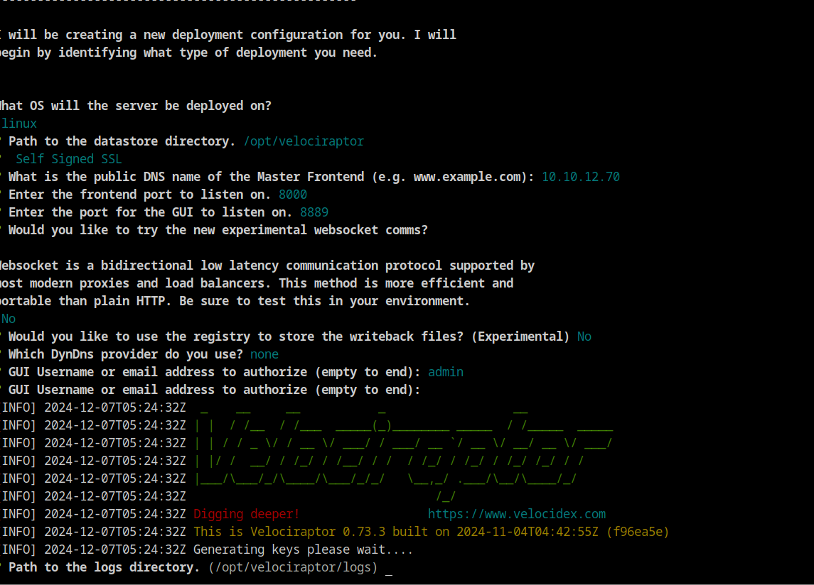
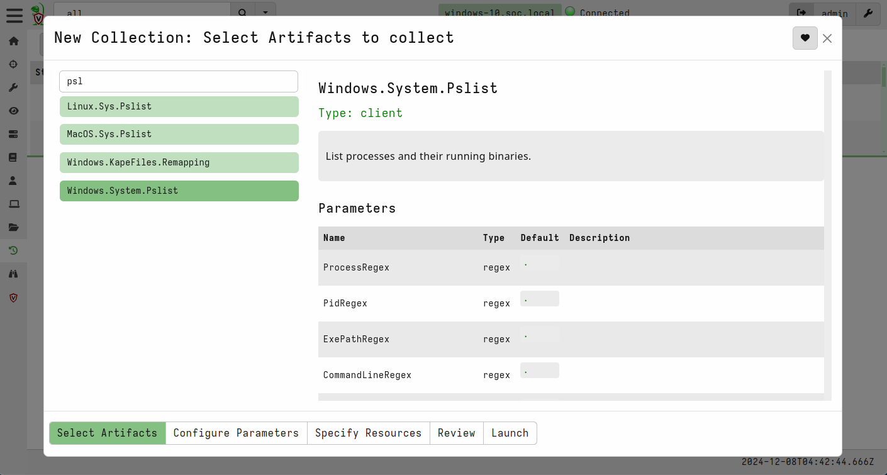
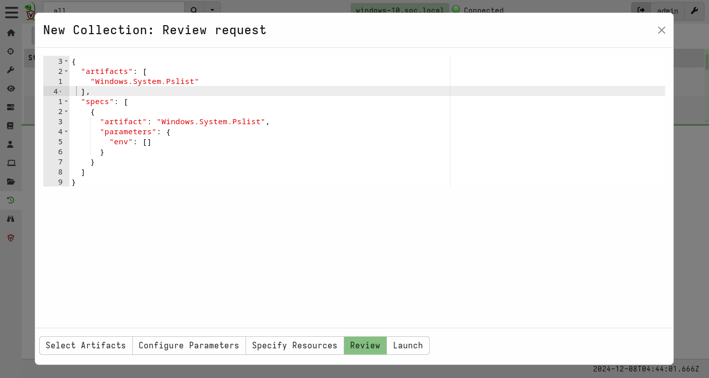
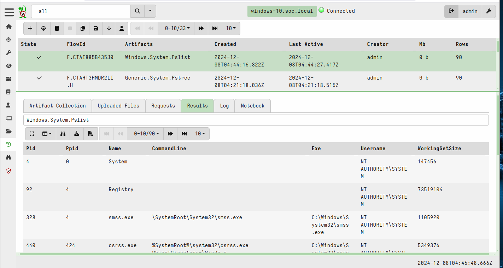
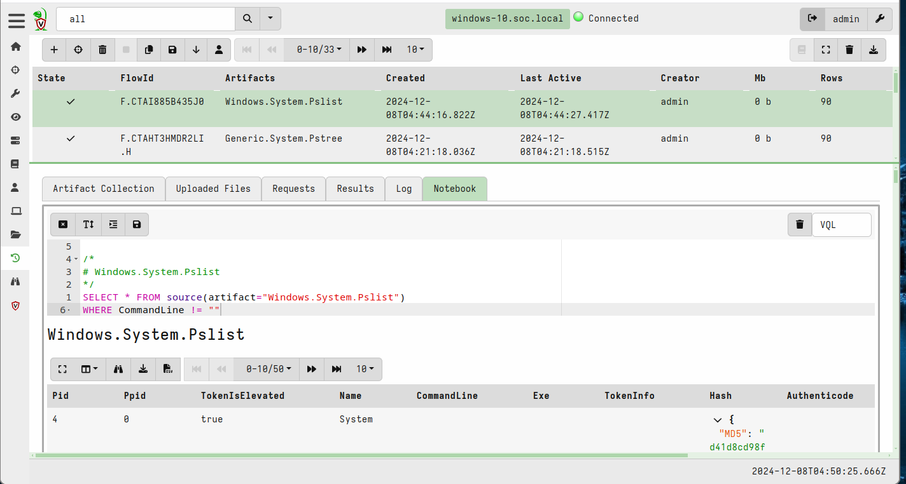
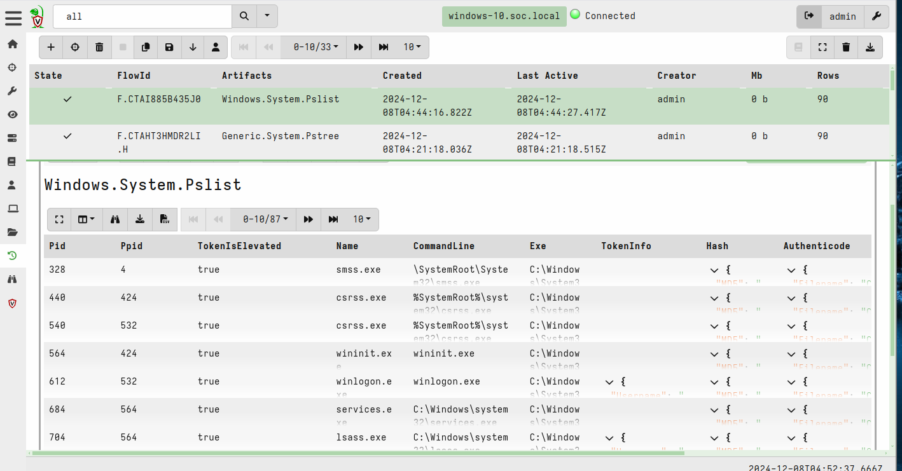

# Velociraptor Home Lab

## Project Objectives

1. **Deploy Velociraptor**: Install and configure Velociraptor on ubuntu and agents on a Windows system.
2. **Perform Forensic Data Collection**: Run predefined and custom hunts to collect forensic artifacts from Windows systems.
3. **Analyze Suspicious Activity**: Identify and investigate suspicious processes, logs, and system changes using Velociraptor.

## Installed Velociraptor on Ubuntu Server &  Configured  Agent on Windows  10

## Collecting artifacts of currently running processes

